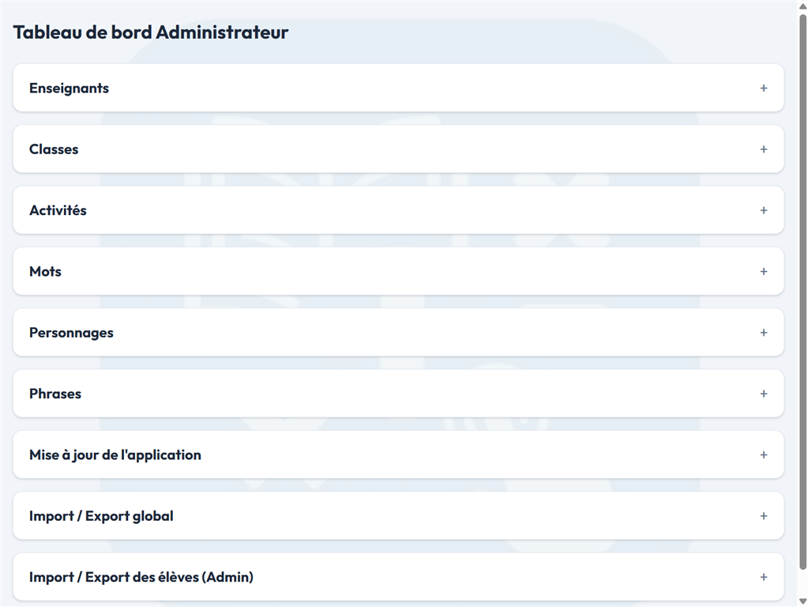
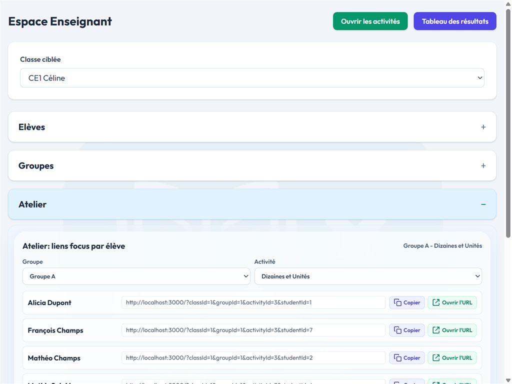
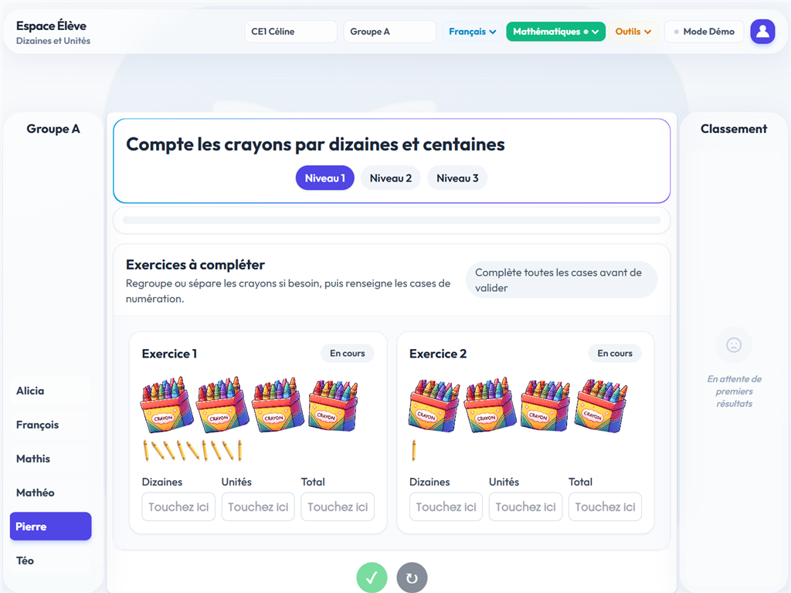
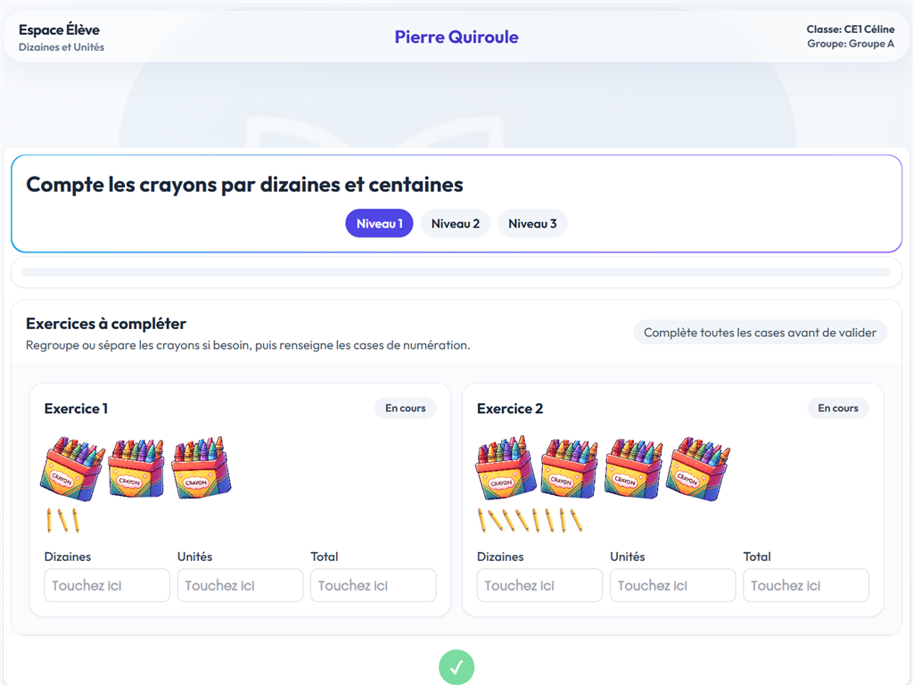
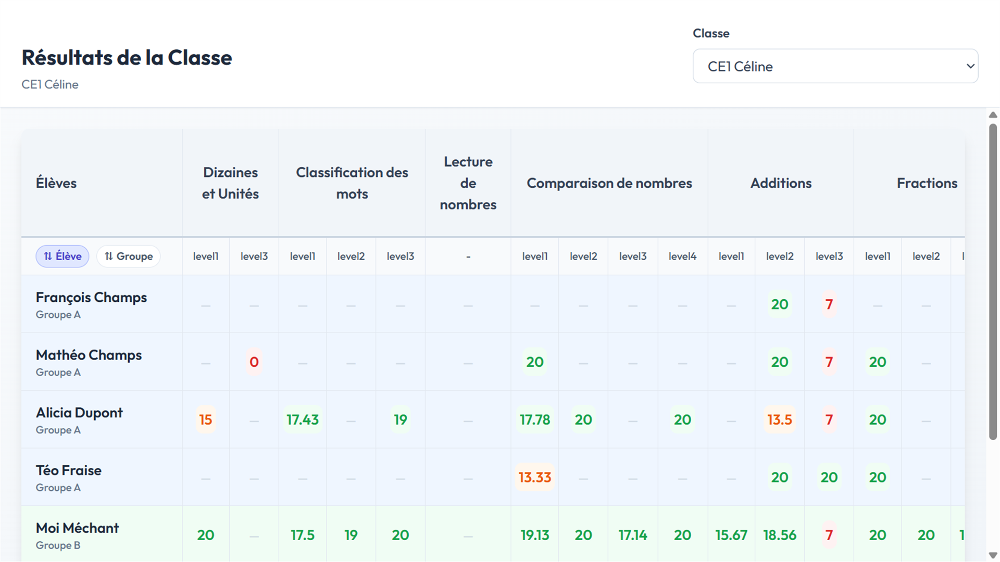

# Ma Classe Interactive

Application web locale pour gérer une classe de primaire et lancer des activités interactives en autonomie, en groupe ou sur TNI.

GITHUB_REPO : https://github.com/sletonqu/ActivitesClasse

---

## ✨ Aperçu

Le projet propose trois espaces complémentaires :

| Espace | URL | Usage principal |
| --- | --- | --- |
| `Admin` | `/admin` | Gérer enseignants, classes, activités, imports/exports globaux |
| `Enseignant` | `/teacher` | Gérer les élèves, groupes, résultats et activités d'une classe |
| `Élève` | `/` | Choisir une classe, filtrer par groupe, lancer une activité ou un mode démo |

### Captures d'écran

Captures réalisées avec les données fictives: les vues Administration, Enseignant, Élève et Mode focus sont au format 1024 × 768 ; la vue Résultats est au format 1920 × 1080.

<table>
  <tr>
    <td align="center"><strong>Administration</strong><br><a href="./docs/screenshots/administration.png"></a></td>
    <td align="center"><strong>Enseignant — atelier, groupe A</strong><br><a href="./docs/screenshots/enseignant.png"></a></td>
  </tr>
  <tr>
    <td align="center"><strong>Élève — Pierre Quiroule, groupe A</strong><br><a href="./docs/screenshots/eleve.png"></a></td>
    <td align="center"><strong>Mode focus — Pierre Quiroule</strong><br><a href="./docs/screenshots/mode-focus.png"></a></td>
  </tr>
</table>

<table>
  <tr>
    <td align="center"><strong>Résultats — classe CE1 Céline (1920 × 1080)</strong><br><a href="./docs/screenshots/resultats.png"></a></td>
  </tr>
</table>

### Stack technique

- **Frontend** : React + React Router + Tailwind CSS
- **Backend** : Node.js + Express
- **Base de données** : SQLite
- **Conteneurisation** : Docker / Docker Compose

---

## 🚀 Démarrage rapide

### Prérequis

- [Docker Desktop](https://docs.docker.com/desktop/setup/install/windows-install/) installé et démarré. **Attention sur Windows** :
  - Il faut au préalable installer et mettre à jour **WSL** (Windows Subsystem for Linux).
  - La **virtualisation matérielle** doit être activée dans le BIOS de la machine.
- Ports `3000` et `4000` disponibles

### Configuration des variables d'environnement

Le backend lit les clés API via le fichier local `.env` (non versionné).

1. Créer le fichier `.env` à partir de `.env.example`.

```powershell
Copy-Item .env.example .env
```

2. Renseigner vos valeurs réelles dans `.env` :

```env
OPENAI_API_KEY=
OPENAI_MODEL=gpt-4.1-mini
GEMINI_API_KEY=
GEMINI_MODEL=gemini-2.5-flash-lite
MISTRAL_API_KEY=
MISTRAL_MODEL=mistral-medium-latest
AI_LOCAL_TOKEN_CORRECTION=false
```

3. Garder `docker-compose.yml` sans secret en clair (uniquement des références `${...}`).

> ⚠️ Si des clés ont déjà été exposées dans l'historique Git ou dans un fichier partagé, il faut les révoquer puis les régénérer.

### Lancer l'application

```bash
docker compose up --build
```

Ou en arrière-plan :

```bash
docker compose up -d --build
```

### Accès

- **Frontend** : `http://localhost:3000`
- **API backend** : `http://localhost:4000`

### Accès HTTPS simple avec ngrok

1. Mettre l'authtoken dans [.env](.env) :

```env
NGROK_AUTHTOKEN=...
```

2. Démarrer le tunnel :

```bash
docker compose --profile ngrok up -d --build
```

3. Lire l'URL HTTPS du frontend :

```powershell
Invoke-RestMethod http://localhost:4040/api/tunnels | Select-Object -ExpandProperty tunnels | Select-Object -ExpandProperty public_url
```

4. Ouvrir cette URL sur la tablette.

### Arrêter l'application

```bash
docker compose down
```

## 🔄 Mise à jour sur un PC de classe

### Mode manuel recommandé

Sur le PC de la classe, le plus simple est d'utiliser le script :

```powershell
powershell -ExecutionPolicy Bypass -File .\scripts\update-application.ps1
```

> 💡 Guide détaillé d'installation et de mise à jour : voir `scripts/README.md`.

Ce script :

- sauvegarde préventivement la base SQLite dans le volume Docker ;
- récupère la dernière version GitHub via `git pull --ff-only` ;
- relance l'application avec `docker compose up -d --build`.

> ⚠️ Les données sont conservées tant que vous n'utilisez pas `docker compose down -v`.

### Mode automatisé depuis l'espace admin

Un panneau **Version et mise à jour** est disponible dans `Admin`.

Pour autoriser le bouton `Demander la mise à jour` sur le PC de classe :

1. démarrer sur Windows le service local suivant :

```powershell
powershell -ExecutionPolicy Bypass -File .\scripts\start-local-updater.ps1 -Token "change-this-token"
```

2. activer les variables suivantes dans `docker-compose.yml` pour le service `backend` :

```yml
ENABLE_ADMIN_UPDATE_TRIGGER=true
HOST_UPDATER_URL=http://host.docker.internal:8765/update
UPDATER_TOKEN=change-this-token
```

> Conseil sécurité : évitez d'écrire des tokens en clair dans `docker-compose.yml`. Préférez des variables d'environnement chargées depuis `.env`.

Ce mode garde la logique de mise à jour **hors du conteneur** : l'interface admin demande l'opération, mais c'est bien le poste Windows qui exécute le script PowerShell.

### Repartir sur une base propre

Les données SQLite sont stockées dans le volume Docker `db-data`.

Pour repartir de zéro :

```bash
docker compose down -v
docker compose up --build
```

> ⚠️ `docker compose down -v` supprime toutes les données locales de l'application.

---

## ✅ Fonctionnalités disponibles

### Administration

- interface en accordéon : sections repliées par défaut, ouverture au clic sur le titre, une seule section ouverte à la fois ;
- **Enseignants** : création, consultation et suppression ;
- **Classes** : création, consultation et suppression ;
- **Activités** : création, modification, suppression et organisation par **discipline** (ex: Mathématiques) et **catégorie** (ex: Calcul) ;
- suppression unitaire ou globale des activités ;
- **Mots** : import du référentiel, recherche et suppression unitaire / globale ;
- **Phrases** : génération par IA et gestion des phrases générées en base ;
- import / export global CSV des `teachers`, `classes`, `groups`, `students`, `activities` et `results` ;
- conservation des colonnes de niveau des résultats (`activity_level`, `activity_level_label`) lors des imports/exports globaux.

### Enseignant

- sélection d'une classe active ;
- interface en accordéon sur les panneaux de gestion (la section `Classe ciblée` reste visible en permanence) ;
- **Élèves** : ajout, consultation et suppression ;
- suppression globale des élèves de la classe ;
- **Groupes** :
  - une classe peut avoir plusieurs groupes ou aucun ;
  - un groupe peut contenir plusieurs élèves ou aucun ;
  - un élève ne peut appartenir qu'à un seul groupe dans sa classe ;
  - ajout, affichage, suppression, vidage et affectation/retrait d'élèves ;
- **Résultats** :
  - consultation des résultats d'un élève ;
  - suppression unitaire ou globale ;
  - calcul d'une moyenne qui remplace uniquement les résultats de la **même activité** et du **même niveau** ;
- import / export CSV ciblé sur une classe avec support des groupes ;
- modification des activités existantes et de leur JSON de configuration.

### Élève

- sélection compacte d'une classe, d'un groupe visible et d'une activité active ;
- filtrage de la liste d'élèves par groupe ;
- exécution d'activités avec niveaux (`level1`, `level2`, `level3` selon l'activité) ;
- activités de tri, de lecture de nombres et de classement en **glisser-déposer** ou en affichage simple selon l'exercice ;
- affichage lisible des grands nombres (ex. `1 234`) dans les activités numériques ;
- enregistrement des scores avec niveau et libellé de niveau ;
- **mode démo** :
  - aucune sélection d'élève requise ;
  - le panneau élève et le classement sont masqués ;
  - aucun résultat n'est enregistré ;
  - le bouton `Recommencer` reste disponible ;
- classement exportable en CSV sur le périmètre visible (classe entière ou groupe filtré).

---

## 📦 Import / export CSV

### Import / export élèves d'une classe

Le flux ciblé classe prend en charge les informations de groupe des élèves :

- `group_id`
- `group_name`

### Import / export global

Le format global attend une colonne `entity` avec l'une des valeurs suivantes :

- `teacher`
- `class`
- `group`
- `student`
- `activity` (supporte les colonnes `discipline` et `category`)
- `result`

Pour les lignes de type `result`, les colonnes suivantes sont désormais supportées :

- `student_id`
- `activity_id`
- `score`
- `completed_at`
- `activity_level`
- `activity_level_label`

---

## 🧩 Activités disponibles

Documentation détaillée : [README des activités](./frontend/src/activities/README.md).

| Activité | Fichier | Objectif |
| --- | --- | --- |
| Tri de nombres | `frontend/src/activities/SortNumbersActivity.js` | Ranger des nombres dans l'ordre croissant ou décroissant. |
| Additions CE1 | `frontend/src/activities/MatchAdditionsActivity.js` | Associer chaque addition à son résultat ou relier un nombre à son double, ou sa moitié. |
| Dizaines et unités | `frontend/src/activities/CountPencilsByTensActivity.js` | Représenter et dénombrer des quantités en unités, dizaines et centaines à l'aide de crayons groupés. |
| Comparaison de nombres | `frontend/src/activities/CompareNumbersActivity.js` | Comparer deux nombres avec les signes `<`, `=` ou `>` et, selon le niveau, leur décomposition. |
| Fractions visuelles | `frontend/src/activities/FractionsVisualSelectionActivity.js` | Lire une fraction représentée par une figure partagée en parts égales et choisir la fraction correspondante. |
| Tableau blanc interactif | `frontend/src/activities/InteractiveWhiteboardActivity.js` | Écrire, dessiner et insérer des images sur un tableau, puis exporter son travail. |
| Classification de mots | `frontend/src/activities/WordClassificationActivity.js` | Classer des mots selon leur catégorie grammaticale. |
| Classification des mots d'une phrase | `frontend/src/activities/SentenceWordClassificationActivity.js` | Repérer les mots demandés dans une phrase et les classer selon leur nature grammaticale. |
| Lecture de nombres | `frontend/src/activities/ReadNumbersActivity.js` | S'entraîner à lire des nombres adaptés au niveau choisi. |
| Le Jeu de la Monnaie | `frontend/src/activities/MakeChangeActivity.js` | Composer une somme exacte avec des pièces et des billets, en euros et, selon le niveau, en centimes. |
| Classement alphabétique | `frontend/src/activities/AlphabeticalSortActivity.js` | Ranger des mots dans l'ordre alphabétique en comparant leurs premières lettres. |
| Sonomètre de classe | `frontend/src/activities/ClassSoundMeterActivity.js` | Visualiser le niveau sonore de la classe et accompagner une période de travail calme chronométrée. |
| Code Junior | `frontend/src/activities/CodeJuniorActivity.js` | Découvrir la programmation au moyen d'un jeu interactif et suivre sa progression. |
| Terminaisons des verbes en `-er` | `frontend/src/activities/VerbEndingCompletionActivity.js` | Compléter des phrases en choisissant la terminaison correcte des verbes en `-er`. |
| Tri de nombres pairs ou impairs | `frontend/src/activities/EvenOddClassificationActivity.js` | Classer des nombres dans la catégorie « pair » ou « impair ». |
| Homophones | `frontend/src/activities/HomophonesActivity.js` | Choisir le bon homophone pour compléter une phrase. |
| Droite graduée | `frontend/src/activities/NumberLineActivity.js` | Trouver les nombres manquants sur une droite graduée à partir des repères affichés. |

> Documentation détaillée : voir `frontend/src/activities/README.md`.

### Focus : tableau blanc interactif

Le tableau blanc propose notamment :

- une **barre d'outils flottante** en bas de l'écran ;
- l'**export PNG** avec le nom de l'élève dans l'image et dans le nom du fichier ;
- l'import / export **JSON** ;
- un fond configurable :
  - `blank` → fond blanc,
  - `seyes` → lignage Seyès,
  - `grid` → quadrillage pour géométrie ;
- une sauvegarde locale par élève via `localStorage`.

Exemple de configuration JSON :

```json
{
  "defaultTitle": "Écriture du jour",
  "width": 1240,
  "height": 1754,
  "backgroundColor": "#ffffff",
  "paperStyle": "seyes",
  "defaultZoom": 0.7,
  "storageKey": "TBTS_INTERACTIVE_WHITEBOARD"
}
```

---

## 🗂️ Structure du projet

```text
.
├── backend/
│   ├── db.js
│   ├── Dockerfile
│   ├── init_db.js
│   ├── init_db.sql
│   ├── package.json
│   ├── server.js
│   └── routes/
├── frontend/
│   ├── Dockerfile
│   ├── package.json
│   ├── public/
│   └── src/
│       ├── activities/
│       ├── components/
│       └── views/
├── docker-compose.yml
└── README.md
```

---

## ➕ Ajouter une nouvelle activité

1. créer un composant dans `frontend/src/activities/` ;
2. exporter une configuration par défaut robuste, compatible avec un `content` vide (`{}`) ;
3. si l'activité gère des niveaux, appeler `onComplete(score, { levelKey, levelLabel })` ;
4. enregistrer l'activité dans `frontend/src/activities/ActivityContainer.js` ;
5. l'ajouter au registre partagé dans `frontend/src/utils/activityManagement.js` ;
6. compléter au même endroit la configuration par défaut (`ACTIVITY_FILES`, `getDefaultActivityContentText()`) si nécessaire ;
7. créer ou modifier l'activité depuis l'espace admin / enseignant.

---

## 🔌 API principale

Quelques routes utiles :

- `GET /api/teachers`
- `POST /api/teachers`
- `GET /api/classes`
- `POST /api/classes`
- `GET /api/students`
- `POST /api/students`
- `DELETE /api/students/:id`
- `GET /api/groups?class_id=:id`
- `POST /api/groups`
- `POST /api/groups/:id/students`
- `DELETE /api/groups/:id/students/:studentId`
- `GET /api/results`
- `POST /api/results`
- `DELETE /api/results/:id`
- `GET /api/activities`
- `POST /api/activities`
- `PUT /api/activities/:id`
- `DELETE /api/activities/:id`
- `DELETE /api/activities`
- `GET /api/words/stats`
- `GET /api/words`
- `DELETE /api/words/:id`
- `DELETE /api/words`
- `GET /api/ai/providers`
- `POST /api/ai/generate-sentence`
- `GET /api/ai/generated-sentences`
- `GET /api/ai/generated-sentences/next`
- `POST /api/ai/generated-sentences/reset-counters`
- `DELETE /api/ai/generated-sentences/:id`
- `DELETE /api/ai/generated-sentences`
- `POST /api/import/csv`
- `GET /api/export/csv`
- `POST /api/import/global-csv`
- `GET /api/export/global-csv`

---

### Réglage de l'animation des tuiles

L'animation de guidage est définie dans [`frontend/tailwind.config.js`](frontend/tailwind.config.js), sous `theme.extend.keyframes["pulse-slow"]` et `theme.extend.animation["pulse-slow"]`.

- Dans l'étape `"50%"`, `opacity` règle l'intensité du clignotement : plus la valeur est basse, plus les éléments s'atténuent.
- Dans `boxShadow`, le premier nombre (`4px`) règle la taille du halo bleu et la dernière valeur (`0.4`) son opacité.
- Dans `animation`, la durée (`3.2s`) règle le rythme : une durée plus courte accélère le clignotement.

Cette animation sert de repère visuel dans les activités interactives : elle peut attirer l'attention sur des choix disponibles, puis, après une sélection, sur une zone à compléter. Elle s'arrête lorsque l'action attendue est réalisée. Le navigateur peut la désactiver si l'utilisateur préfère réduire les animations.

Après avoir modifié la configuration Tailwind, reconstruire le frontend avec :

```bash
rtk docker compose up --build -d
```

## ⚠️ Notes actuelles

- application conçue pour un TNI `1024x768` (4:3), type Smart Board M600 DViT ;
- les mots de passe enseignants sont encore stockés en clair : à sécuriser avant une mise en production ;
- les clés/tokens ne doivent jamais être commités en clair dans `docker-compose.yml` ;
- le projet est pensé pour un usage **local / MVP** ;
- le chargement des activités repose sur un registre explicite dans `ActivityContainer.js`.
